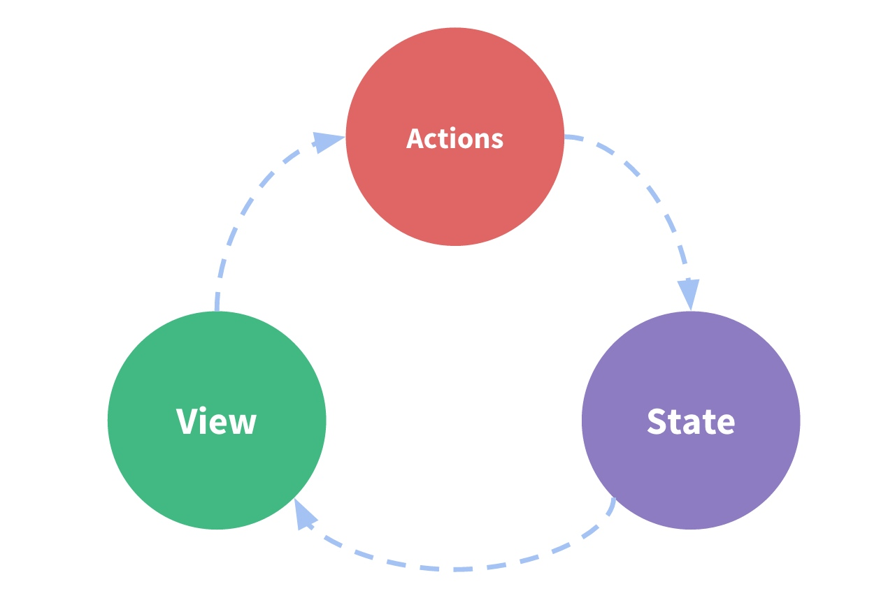
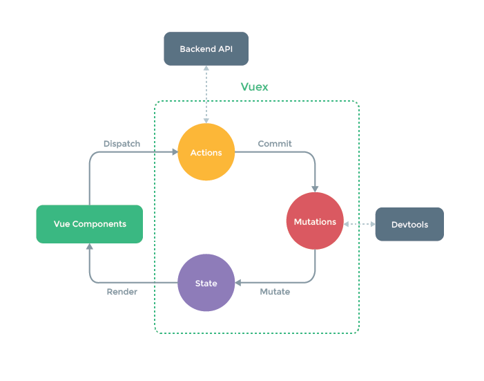
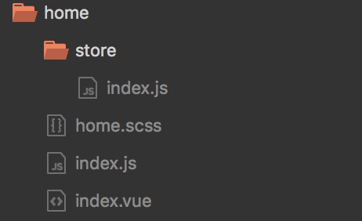

# Vuex 是什么？

Vuex 是一个专为 Vue.js 应用程序开发的***状态管理模式***。它采用集中式存储管理应用的所有组件的状态，并以相应的规则保证状态以一种可预测的方式发生变化。Vuex 也集成到 Vue 的官方调试工具 `devtools extension`，提供了诸如零配置的 time-travel 调试、状态快照导入导出等高级调试功能。

# 什么是“状态管理模式”？

让我们从一个简单的 Vue 计数应用开始：

```js
new Vue({
  // state
  data () {
    return {
      count: 0
    }
  },
  // view
  template: `
    <div>{{ count }}</div>
  `,
  // actions
  methods: {
    increment () {
      this.count++
    }
  }
})
```
这个状态自管理应用包含以下几个部分：
	•	state，驱动应用的数据源；
	•	view，以声明方式将 state 映射到视图；
	•	actions，响应在 view 上的用户输入导致的状态变化。
	
以下是一个表示“单向数据流”理念的极简示意：




但是，当我们的应用遇到多个组件共享状态时，单向数据流的简洁性很容易被破坏：
	•	多个视图依赖于同一状态。
	•	来自不同视图的行为需要变更同一状态。
对于问题一，传参的方法对于多层嵌套的组件将会非常繁琐，并且对于兄弟组件间的状态传递无能为力。对于问题二，我们经常会采用父子组件直接引用或者通过事件来变更和同步状态的多份拷贝。以上的这些模式非常脆弱，通常会导致无法维护的代码。
因此，我们为什么不把组件的共享状态抽取出来，以一个全局单例模式管理呢？在这种模式下，我们的组件树构成了一个巨大的“视图”，不管在树的哪个位置，任何组件都能获取状态或者触发行为！
另外，通过定义和隔离状态管理中的各种概念并强制遵守一定的规则，我们的代码将会变得更结构化且易维护。
这就是 Vuex 背后的基本思想，借鉴了 Flux、Redux、和 The Elm Architecture。与其他模式不同的是，Vuex 是专门为 Vue.js 设计的状态管理库，以利用 Vue.js 的细粒度数据响应机制来进行高效的状态更新。




	
## 什么情况下我应该使用 Vuex？

虽然 Vuex 可以帮助我们管理共享状态，但也附带了更多的概念和框架。这需要对短期和长期效益进行权衡。
如果您不打算开发大型单页应用，使用 Vuex 可能是繁琐冗余的。确实是如此——如果您的应用够简单，您最好不要使用 Vuex。一个简单的 global event bus 就足够您所需了。但是，如果您需要构建是一个中大型单页应用，您很可能会考虑如何更好地在组件外部管理状态，Vuex 将会成为自然而然的选择。

# 项目中的使用

首先来到我们的业务文件夹下，新建vuex文件夹store，然后新建store/index.js。



来到store/index.js

```javascript

const state = {
	msg: '欢迎进入您的Sweet应用'
};

const mutations = {

};

const actions = {

};

const getters = {

};

export default {
	state,
	mutations,
	actions,
	getters
};

```

# State

## 单一状态树

Vuex 使用单一状态树——是的，用一个对象就包含了全部的应用层级状态。至此它便作为一个“唯一数据源 **(SSOT)**”而存在。这也意味着，每个应用将仅仅包含一个 store 实例。单一状态树让我们能够直接地定位任一特定的状态片段，在调试的过程中也能轻易地取得整个当前应用状态的快照。
单状态树和模块化并不冲突——在后面的章节里我们会讨论如何将状态和状态变更事件分布到各个子模块中。

## 结合mapState辅助函数

设置了我们的state状态树之后，我们需要每一个状态转化为vue实例中的计算属性来支持业务逻辑，通过使用mapState的函数来快速关联。比如：

```javascript
// ./store/index.js
const state = {
	name: '小明',
	age: '20',
	sex: '男' 
}

// .vue文件
beforeCreate() {
   // 注册当前模块到Store
   if (!this.$store.state.mystore) {
       this.$store.registerModule('mystore', store);
   }
},
computed: {
	...mapState({
		name: state => state.mystore.name,
		age: state => state.mystore.age,
		sex: state => state.mystore.sex
	})
}
```

当状态树发生变化时，相对应的关联属性也会发生变化。

**修改state必须要在mutations中修改，外部不允许修改**

# Mutation

更改 Vuex 的 store 中的状态的唯一方法是提交 mutation。Vuex 中的 mutation 非常类似于事件：每个 mutation 都有一个字符串的 事件类型 (type) 和 一个 回调函数 (handler)。这个回调函数就是我们实际进行状态更改的地方，并且它会接受 state 作为第一个参数：

```javascript
const state = {
	count: 1
}

const mutations = {
	increment (state) {
	 // 变更状态
	 state.count++
	}
}
```

在.vue中的调用

```
beforeCreate() {
   // 注册当前模块到Store
   if (!this.$store.state.mystore) {
       this.$store.registerModule('mystore', store);
   }
},
methods: {
	increment() {
		this.$store.commit('increment');
	}
}
```

**在团队合作项目中，不加命名空间的mutation会发生重名，所以推荐在store加上命名空间**

```javascript
const state = {
	msg: '欢迎进入您的Sweet应用'
};

const mutations = {

};

const actions = {

};

const getters = {

};

export default {
	// 在此处加上配置项，表明需要使用命名空间
	namespaced: true,
	state,
	mutations,
	actions,
	getters
};


// .vue 文件
beforeCreate() {
   // 注册当前模块到Store
   if (!this.$store.state.mystore) {
       this.$store.registerModule('mystore', store);
   }
},
methods: {
	increment() {
		// 加上命名空间的调用方式:{namespace}/{mutation}
		this.$store.commit('mystore/increment');
	}
}
```

## Mutation 必须是同步函数

所有异步操作不能再mutation里写，所以我们把xhr请求全部放入actions里。

# Action

Action 类似于 mutation，不同在于：
	•	Action 提交的是 mutation，而不是直接变更状态。
	•	Action 可以包含任意异步操作。


```javascript

const state = {
	count: 1
}

const mutations = {
	increment (state) {
	 // 变更状态
	 state.count++
	}
}

const actions = {
	increment (context) {
		// 只能在mutations里去更改状态树
      context.commit('increment')
   }
}

```

## 分发 Action

在.vue中调用action

```javascript
// .vue 文件
beforeCreate() {
   // 注册当前模块到Store
   if (!this.$store.state.mystore) {
       this.$store.registerModule('mystore', store);
   }
},
methods: {
	increment() {
		// 加上命名空间的调用方式:{namespace}/{action}
		this.$store.dispatch('mystore/increment');
	}
}
```
## 结合mapActions辅助函数

使用mapActions能够快速关联vue实例的方法和store/actions

```javascript
// ...
  methods: {
    ...mapActions([
    // 将 `this.increment()` 映射为 `this.$store.dispatch('increment')`
      'increment',
      // `mapActions` 也支持载荷：
      // 将 `this.incrementBy(amount)` 映射为 `this.$store.dispatch('incrementBy', amount)`
      'incrementBy'
    ]),
    ...mapActions({
    // 将 `this.add()` 映射为 `this.$store.dispatch('increment')`
      add: 'increment'
    })
  }
```

## 异步Action

巧妙使用 `async / await`，来构造异步的actions

```javascript
// 假设 getData() 和 getOtherData() 返回的是 Promise

actions: {
  async actionA ({ commit }) {
    commit('gotData', await getData())
  },
  async actionB ({ dispatch, commit }) {
    await dispatch('actionA') // 等待 actionA 完成
    commit('gotOtherData', await getOtherData())
  }
}
```

在.vue中调用

```javascript
// .vue 文件
beforeCreate() {
   // 注册当前模块到Store
   if (!this.$store.state.mystore) {
       this.$store.registerModule('mystore', store);
   }
},
methods: {
	test() {
		// 加上命名空间的调用方式:{namespace}/{action}
		var response = await this.$store.dispatch('mystore/actionB');
	}
}
```


